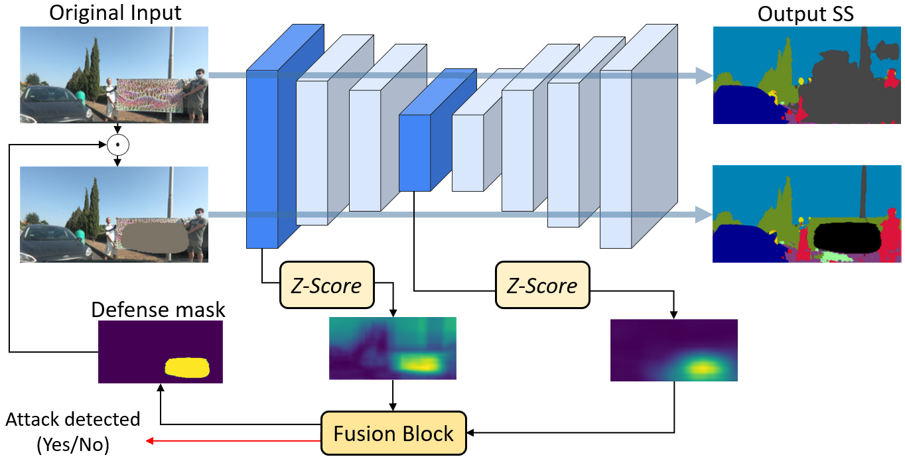

# ZMask - Defending from Physically-Realizable Adversarial Attacks through Internal Over-Activation Analysis

This repository provides a simple demo to showcase the main steps performed in the paper [Defending from Physically-Realizable Adversarial Attacks through Internal Over-Activation Analysis](https://ojs.aaai.org/index.php/AAAI/article/view/26758)

The code includes the main utility functions and a Jupyter notebook demo to train and test ZMASK on top of a segmentation model.



### Installation

To install the necessary dependencies, follow these steps:

1. Clone the repository:

2. Create and activate a virtual environment 

3. Install the required packages:
    ```bash
    pip install -r requirements.txt
    ```

4. Follow the steps in the provided Jupyter notebook to run the demo.


### TODO
- Add more detailed comments and explanations in the demo notebook.
- Add script for testing.


### Citation
If you found our work useful, please consider citing the paper!
```
@article{Rossolini_Nesti_Brau_Biondi_Buttazzo_2023, 
title={Defending from Physically-Realizable Adversarial Attacks through Internal Over-Activation Analysis}, 
journal={Proceedings of the AAAI Conference on Artificial Intelligence}, author={Rossolini, Giulio and Nesti, Federico and Brau, Fabio and Biondi, Alessandro and Buttazzo, Giorgio}, year={2023}, month={Jun.}, pages={15064-15072} }
volume={37}, number={12},
url={https://ojs.aaai.org/index.php/AAAI/article/view/26758}, DOI={10.1609/aaai.v37i12.26758}
}
```
### Related work
We have recently deepened the analysis of over-activation in multi-frame scenarios (accepted at ICCPS'24):
```
@ARTICLE{2022arXiv220604365N,
       @article{rossolini2023attention,
  title={Attention-Based Real-Time Defenses for Physical Adversarial Attacks in Vision Applications},
  author={Rossolini, Giulio and Biondi, Alessandro and Buttazzo, Giorgio},
  journal={arXiv preprint arXiv:2311.11191},
  year={2023}
}
}
```

### Other Repos
- [PatchAttackTool](https://github.com/retis-ai/PatchAttackTool)
- [CarlaGear](https://github.com/retis-ai/CARLA-GeAR)


